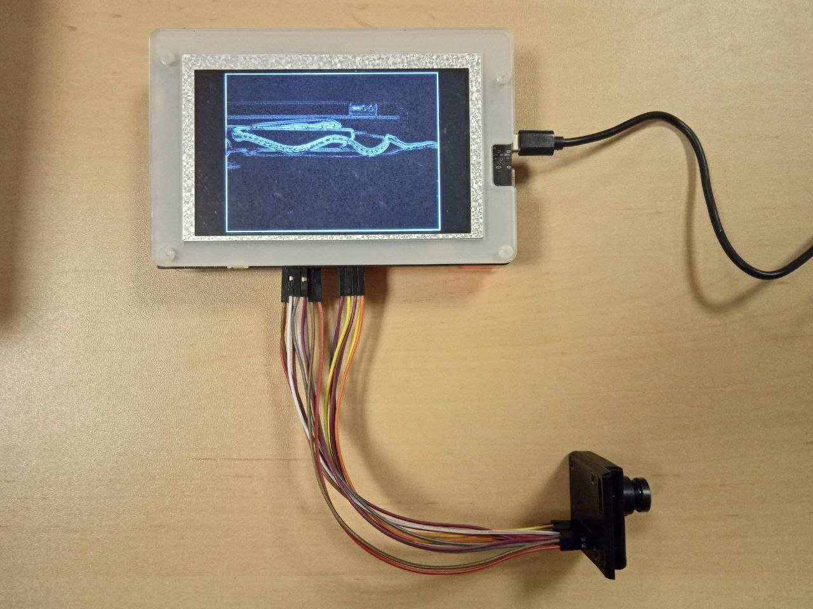

= svconv
:toc: macro
:toc-title: Содержание

image:https://github.com/metrapoliten/svconv/actions/workflows/ci.yml/badge.svg[CI,link=https://github.com/metrapoliten/svconv/actions/workflows/ci.yml]

Потоковая свёртка изображения с камеры на ПЛИС Gowin, написанная на SystemVerilog. Кадр с камеры
OmniVision OV7670 (640×480) переводится в оттенки серого, проходит цепочку из трёх каскадов
свёртки 5×5 (размытие, размытие, выделение границ) и выводится на дисплей 5" 800×480. Обработка
идёт потоком, по мере поступления пикселей, без внешней памяти; каскады можно отключать кнопкой.

Проект основан на упражнениях главы 11 курса
https://lamagraph.github.io/intro-to-fpga-with-clash/11-bsram/exercises.html[«Введение в FPGA с Clash»]
и как эталон для будущей реализации на Clash: вместе со схемой в репозитории есть эталонная модель
на Python, тесты относительно неё и формальные доказательства свойств ключевых модулей.

Стенд в режиме выделения границ. Видео работы:
https://drive.google.com/file/d/1t8LoTIyx3wRphg3qyryX0RDgzrGEfTvg/view?usp=sharing[Google Drive].

toc::[]

== Оборудование

* Плата Sipeed Tang Mega 138K Pro Dock (ПЛИС Gowin GW5AST-LV138FPG676A).
* Модуль камеры OmniVision OV7670, 2×9 выводов, подключённый проводами «мама–папа» к гнёздам PMOD1
  (J24) и PMOD2 (J26) дока по порядку выводов модуля.
* Дисплей SH500Q01Z, 5", 800×480, с контроллером ILI6122 — в разъём J20 дока.

Подключение камеры (контакты гнёзд — по схеме дока; контакт 1 — квадратная площадка):

[cols="1,3"]
|===
| Гнездо | Контакты → выводы модуля OV7670

| PMOD1 | 1 — 3V3, 3 — GND, 5 — SIOC, 6 — SIOD, 7 — VSYNC, 8 — HREF, 9 — PCLK, 10 — XCLK, 11 — D7, 12 — D6
| PMOD2 | 5 — D5, 6 — D4, 7 — D3, 8 — D2, 9 — D1, 10 — D0, 11 — RESET, 12 — PWDN
|===

Выводы ПЛИС и меры против помех на проводах — в `boards/mega138k/camera_lcd.cst`.

== Использование

Кнопка S1 переключает режим обработки по кругу:

[cols="1,3"]
|===
| Режим | Цепочка

| 0 (после включения) | размытие → размытие → выделение границ
| 1 | без обработки
| 2 | только размытие
| 3 | только выделение границ
|===

Светодиоды дока (горят при 0):

* LED0 — мигает раз в секунду: прошивка работает;
* LED1 — камера настроена;
* LED2 — переключается на каждом обработанном кадре;
* LED3 — веса ядер загружены;
* LED4, LED5 — номер режима.

== Сборка и загрузка

Зависимости:

* https://www.gowinsemi.com/[Gowin EDA] (проверено с V1.9.12.04) — синтез,
  размещение, временной анализ;
* https://github.com/trabucayre/openFPGALoader[openFPGALoader] — загрузка в плату;
* Python 3.14 или новее с пакетами из `requirements.txt`.

[source,sh]
----
python3 -m venv .venv
.venv/bin/pip install -r requirements.txt

# GOWIN_HOME — каталог установки Gowin EDA (в нём bin/gw_sh)
GOWIN_HOME=/path/to/gowin make -C boards/mega138k camera_lcd
make -C boards/mega138k load-camera_lcd
----

Прошивка загружается в SRAM ПЛИС и действует до выключения питания; flash не меняется. После
сборки `boards/mega138k/Makefile` проверяет запас по времени на входе дисплея
(`tools/check_lcd_timing.py`).

== Проверка

Дополнительные зависимости: https://github.com/steveicarus/iverilog[Icarus Verilog] 13,
https://github.com/chipsalliance/verible[Verible] (проверено с v0.0-4163-g6cce8f19).

[source,sh]
----
make test      # эталонная модель (pytest) и тесты модулей (cocotb, Icarus Verilog)
make lint      # линтер Verible
make format    # форматирование: Verible для SystemVerilog, black для Python
make formal    # формальная верификация (SymbiYosys, YoWASP, Yices)

# Сквозные тесты верхнего модуля (около часа): нужна библиотека моделей Gowin
GOWIN_HOME=/path/to/gowin make test-top
----

CI на GitHub Actions выполняет линтер, проверку форматирования, `make test` и `make formal`.
Сквозные тесты верхнего модуля в CI не запускаются: библиотеку моделей Gowin нельзя
распространять.

== Устройство

Модули по ходу данных от камеры к дисплею (подробности — в комментариях в начале каждого модуля):

* `rtl/camera/ov7670_init.sv`, `rtl/camera/sccb_writer.sv` — аппаратный сброс камеры и запись
  её регистров по SCCB;
* `rtl/camera/dvp_capture.sv` — захват кадра RGB565 по параллельному интерфейсу DVP; тактируется
  сигналом PCLK камеры;
* `rtl/core/rgb565_to_gray.sv` — перевод в оттенки серого;
* `rtl/core/conv_pipeline.sv` — цепочка каскадов свёртки с обходом; `rtl/core/conv2d_stage.sv` —
  каскад: K+1 строчных буферов в блочной памяти, окно K×K на регистрах, умножители, постобработка;
  один пиксель за такт; `rtl/core/kernel_rom.sv` — ПЗУ весов ядер;
* `rtl/video/frame_buffer.sv` — кадровый буфер между тактовыми доменами камеры и дисплея;
* `rtl/video/lcd_output.sv` — вывод на RGB-дисплей в режиме DE с центрированием кадра;
* `boards/mega138k/camera_lcd_top.sv` — верхний модуль платы: PLL, кнопка режимов, передача
  режима между доменами, выходы на дисплей в регистрах блоков ввода-вывода.

Схема работает в трёх тактовых доменах: 50 МГц (настройка, кнопка), PCLK камеры 25 МГц (захват и
обработка) и 35 МГц (дисплей).

Эталонная модель (`model/svconv_model.py`) повторяет вычисления схемы в целых числах.
`model/demo.py` применяет цепочку ядер к фотографии:

[source,sh]
----
.venv/bin/python model/demo.py photo.jpg out/ --chain gauss5,gauss5,log5
----

== Структура репозитория

[cols="1,3"]
|===
| Каталог | Содержимое

| `rtl/` | модули на SystemVerilog, не зависящие от платы
| `boards/mega138k/` | верхний модуль, ограничения выводов и времени, сборка для Tang Mega 138K Pro
| `model/` | эталонная модель на Python и генерация файлов инициализации памяти
| `tests/` | тесты на cocotb
| `formal/` | формальные доказательства (SymbiYosys)
| `tools/` | проверка таймингов дисплея по отчёту Gowin
|===

== Как помочь проекту

Ошибки и предложения — в https://github.com/metrapoliten/svconv/issues[Issues]. Перед
пулл-реквестом запустите `make lint`, `make format` и `make test`.

== Лицензия

Код распространяется по лицензии MIT (`LICENSE`). Таблица регистров камеры взята из проекта
FPGA_OV7670_Camera_Interface (MIT, Angelo Jacobo) — текст его лицензии в `THIRD_PARTY_NOTICES`.
